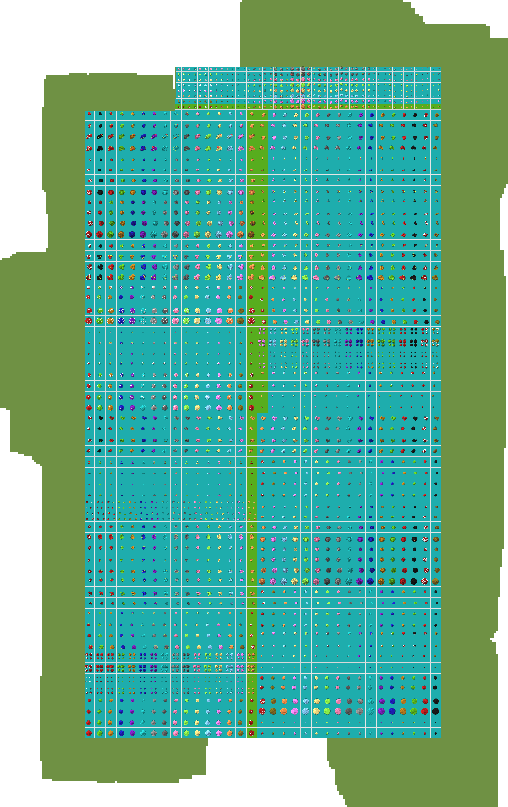

# Automated Schematic Generator 

Nothing special, just automatically gets a schematic of an area within a grid cell across a huge grid of buildings. 

For reference, this is what I'm working with

    

If you want the password to the world archive, send me a message on discord 😘